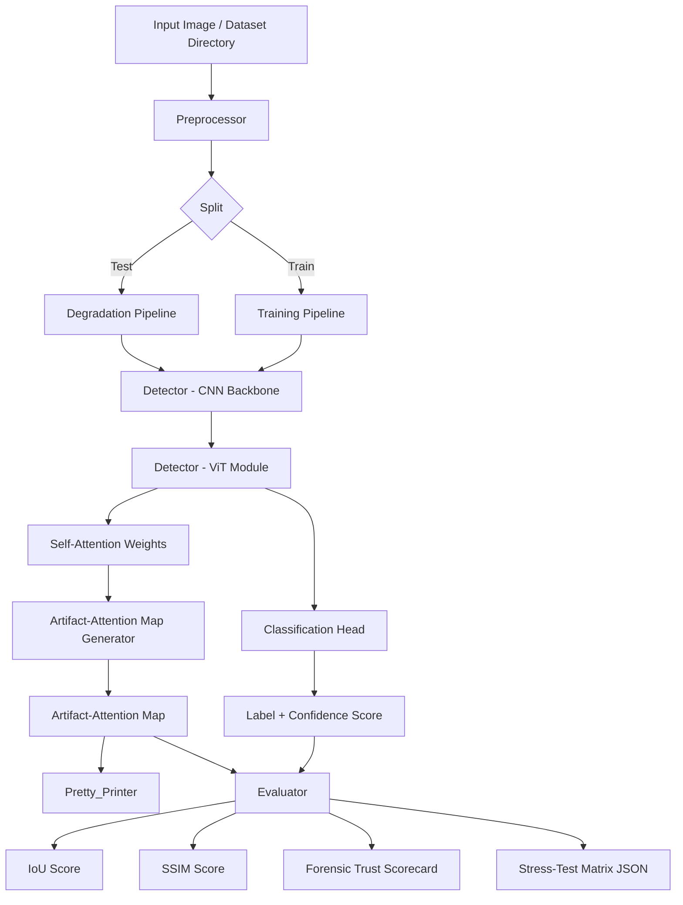

# Design Document: Self-Explaining Hybrid CNN-ViT Framework for Deepfake Detection

## Overview

This document describes the technical design of a hybrid CNN-ViT deepfake detection framework that generates native, self-explaining Artifact-Attention Maps from ViT self-attention weights. The system is implemented in Python with PyTorch and evaluated against FaceForensics++ and Celeb-DF benchmarks.

The key design principle is **inherent explainability**: rather than applying post-hoc XAI tools (Grad-CAM, LIME) after the fact, the framework extracts attention weights that are already computed during the forward pass. This makes explanations computationally free and mathematically grounded in the model's actual decision process.

The framework is structured around four independently testable components:
- `Preprocessor` — data loading, normalization, and degradation application
- `Detector` — hybrid CNN-ViT model producing predictions and attention maps
- `Evaluator` — metric computation (IoU, SSIM, Forensic Trust Scorecard)
- `Pretty_Printer` — visualization of attention maps as overlays

---

## Architecture



### High-Level Data Flow

1. The `Preprocessor` loads images, resizes to 224×224, normalizes, and (for test splits) applies degradations.
2. The `Detector` runs a forward pass: CNN backbone → patch embedding → ViT layers → [CLS] classification.
3. During the forward pass, self-attention weights from the final ViT layer are captured via PyTorch hooks.
4. The `Artifact-Attention Map Generator` (part of `Detector`) averages [CLS] attention across heads, reshapes to spatial grid, and upsamples to input resolution.
5. The `Evaluator` computes IoU (vs. ground-truth mask), SSIM (across degradation pairs), and the Forensic Trust Scorecard.
6. The `Pretty_Printer` renders overlays and saves them to disk.

---

## Components and Interfaces

### Preprocessor

```python
class Preprocessor:
    def __init__(self, config: PreprocessorConfig): ...

    def load_dataset(self, root_dir: str, split: str) -> Dataset:
        """Returns a PyTorch Dataset of (image_tensor, label, mask_or_None) tuples."""

    def apply_degradation(self, image: PIL.Image, degradation: DegradationSpec) -> PIL.Image:
        """Applies a single degradation to an image. Pure function."""

    def build_degradation_pipeline(self, specs: List[DegradationSpec]) -> Callable:
        """Returns a composed transform applying specs in order: JPEG → blur → noise."""
```

**DegradationSpec** is a tagged union:
```python
@dataclass
class JPEGDegradation:
    quality: int  # 1–95

@dataclass
class GaussianBlurDegradation:
    kernel_size: int  # odd, >= 1
    sigma: float      # > 0

@dataclass
class GaussianNoiseDegradation:
    std: float  # >= 0

DegradationSpec = Union[JPEGDegradation, GaussianBlurDegradation, GaussianNoiseDegradation]
```

### Detector (CNN-ViT Model)

```python
class HybridCNNViT(nn.Module):
    def __init__(self, config: ModelConfig): ...

    def forward(self, x: Tensor) -> DetectorOutput:
        """
        Returns:
          - logits: Tensor[B, 2]
          - confidence: Tensor[B]  (softmax probability of deepfake class)
          - attention_weights: Tensor[B, num_heads, seq_len, seq_len]
        """

    def generate_artifact_attention_map(self, attention_weights: Tensor, input_hw: Tuple[int,int]) -> Tensor:
        """
        Extracts [CLS] attention, averages over heads, reshapes to spatial grid,
        upsamples to input_hw via bilinear interpolation, normalizes to [0,1].
        Returns: Tensor[B, H, W]
        """

    def save_checkpoint(self, path: str): ...

    @classmethod
    def load_checkpoint(cls, path: str) -> 'HybridCNNViT': ...
```

**DetectorOutput**:
```python
@dataclass
class DetectorOutput:
    label: int           # 0 = real, 1 = deepfake
    confidence: float    # in [0.0, 1.0]
    attention_map: Tensor  # shape [H, W], normalized to [0,1]
```

### CNN Backbone

A lightweight feature extractor (e.g., 4-layer ConvNet or MobileNetV2-style) that maps an input image tensor `[B, 3, H, W]` to a feature map `[B, C, H', W']`. The feature map is then flattened into a sequence of patch tokens `[B, N, D]` for the ViT.

Design decision: using a lightweight CNN (rather than a full ResNet) keeps the backbone fast and avoids over-parameterization. The CNN's role is purely local artifact extraction; global reasoning is delegated to the ViT.

### ViT Module

A standard multi-layer Transformer encoder operating on the patch token sequence. A learnable [CLS] token is prepended. Self-attention weights from the **final layer** are captured via a forward hook registered on the last `nn.MultiheadAttention` module.

Design decision: using only the final layer's attention weights (rather than rollout across all layers) keeps the attention map computation simple and directly tied to the classification decision.

### Evaluator

```python
class Evaluator:
    def compute_iou(self, attention_map: Tensor, gt_mask: Tensor, threshold_percentile: float = 90.0) -> float:
        """Thresholds attention map at given percentile, computes IoU with gt_mask."""

    def compute_ssim(self, map_a: Tensor, map_b: Tensor) -> float:
        """Computes SSIM between two attention maps using 11x11 Gaussian window, sigma=1.5."""

    def run_stress_test_matrix(self, detector: HybridCNNViT, dataset: Dataset, matrix_config: MatrixConfig) -> StressTestResults:
        """Runs detector over all (degradation_type, severity) combinations."""

    def compute_forensic_trust_scorecard(self, results: StressTestResults, weights: ScorecardWeights) -> Scorecard:
        """Computes weighted composite score from accuracy, mean IoU, mean SSIM."""

    def serialize_results(self, results: Any, output_path: str): ...
```

### Pretty_Printer

```python
class Pretty_Printer:
    def render_overlay(self, image: PIL.Image, attention_map: Tensor, output_path: str) -> None:
        """Renders attention map as a color-coded (jet colormap) overlay on the original image and saves to output_path."""
```

---

## Data Models

### PreprocessorConfig

```python
@dataclass
class PreprocessorConfig:
    target_size: Tuple[int, int] = (224, 224)
    mean: Tuple[float, float, float] = (0.485, 0.456, 0.406)
    std: Tuple[float, float, float] = (0.229, 0.224, 0.225)
    dataset_type: str = "ff++"  # "ff++" | "celeb-df"
```

### ModelConfig

```python
@dataclass
class ModelConfig:
    cnn_out_channels: int = 256
    patch_size: int = 16
    vit_num_layers: int = 6
    vit_num_heads: int = 8
    vit_embed_dim: int = 512
    num_classes: int = 2
```

### MatrixConfig

```python
@dataclass
class MatrixConfig:
    jpeg_qualities: List[int]       # e.g., [95, 75, 50, 25, 10]
    blur_sigmas: List[float]        # e.g., [0.0, 1.0, 2.0, 4.0]
    noise_stds: List[float]         # e.g., [0.0, 0.05, 0.1, 0.2]
    include_baseline: bool = True
```

### ScorecardWeights

```python
@dataclass
class ScorecardWeights:
    accuracy_weight: float = 0.4
    iou_weight: float = 0.4
    ssim_weight: float = 0.2
    # Invariant: accuracy_weight + iou_weight + ssim_weight == 1.0
```

### StressTestResults

```python
@dataclass
class StressTestResults:
    rows: List[StressTestRow]

@dataclass
class StressTestRow:
    degradation_type: str   # "baseline" | "jpeg" | "blur" | "noise"
    severity: float         # numeric severity value
    accuracy: float
    mean_iou: float | None
    mean_ssim: float | None
```

### Scorecard

```python
@dataclass
class Scorecard:
    accuracy: float
    mean_iou: float | None
    mean_ssim: float | None
    composite_score: float
    weights_used: ScorecardWeights
```

### InferenceReport

```python
@dataclass
class InferenceReport:
    image_path: str
    label: str              # "real" | "deepfake"
    confidence: float
    attention_map_path: str
    iou_score: float | None
```

---

## Correctness Properties

*A property is a characteristic or behavior that should hold true across all valid executions of a system — essentially, a formal statement about what the system should do. Properties serve as the bridge between human-readable specifications and machine-verifiable correctness guarantees.*

### Property 1: Degradation identity at zero intensity

*For any* valid input image, applying a degradation at zero intensity (JPEG quality=95, blur sigma=0, noise std=0) should produce an output image whose pixel values differ from the original by no more than a small tolerance (≤ 5/255 per channel, accounting for JPEG's lossy nature at quality 95).

**Validates: Requirements 2.4**

---

### Property 2: Degradation pipeline ordering

*For any* input image and any combination of JPEG, blur, and noise degradation specs, applying them via `build_degradation_pipeline` should produce the same result as applying JPEG first, then blur, then noise individually in sequence.

**Validates: Requirements 2.5**

---

### Property 3: Attention map spatial dimensions match input

*For any* input image tensor of shape `[B, 3, H, W]`, the Artifact-Attention Map returned by `generate_artifact_attention_map` should have spatial dimensions `[B, H, W]` — matching the input height and width exactly.

**Validates: Requirements 4.3**

---

### Property 4: Attention map value range

*For any* input image tensor, the Artifact-Attention Map values should all lie in the range `[0.0, 1.0]` after normalization.

**Validates: Requirements 4.4, 4.5**

---

### Property 5: Confidence score range

*For any* input image tensor, the confidence score returned by the Detector should lie in the range `[0.0, 1.0]`.

**Validates: Requirements 3.3**

---

### Property 6: IoU score range

*For any* attention map and ground-truth mask pair, the IoU score computed by the Evaluator should lie in the range `[0.0, 1.0]`.

**Validates: Requirements 5.2, 5.3**

---

### Property 7: IoU zero union edge case

*For any* attention map and ground-truth mask where both the thresholded prediction mask and the ground-truth mask are entirely zero (empty), the Evaluator should return an IoU score of exactly 0.0.

**Validates: Requirements 5.3**

---

### Property 8: SSIM score range

*For any* pair of valid attention maps, the SSIM score computed by the Evaluator should lie in the range `[-1.0, 1.0]`, and for identical maps should return exactly 1.0.

**Validates: Requirements 6.1**

---

### Property 9: Scorecard weights sum to 1.0

*For any* ScorecardWeights instance used in Forensic Trust Score computation, the sum of `accuracy_weight + iou_weight + ssim_weight` should equal 1.0 (within floating-point tolerance of 1e-6).

**Validates: Requirements 8.1**

---

### Property 10: Scorecard composite score range

*For any* StressTestResults and valid ScorecardWeights, the composite Forensic Trust Score should lie in the range `[0.0, 1.0]`.

**Validates: Requirements 8.1**

---

### Property 11: Model checkpoint round-trip

*For any* trained HybridCNNViT model, saving to a checkpoint file and loading it back should produce a model whose parameters are identical to the original (bit-for-bit equality of all weight tensors).

**Validates: Requirements 3.6**

---

### Property 12: Stress-Test Matrix baseline row inclusion

*For any* MatrixConfig with `include_baseline=True`, the StressTestResults produced by `run_stress_test_matrix` should contain exactly one row with `degradation_type == "baseline"`.

**Validates: Requirements 7.4**

---

### Property 13: Inference report serialization round-trip

*For any* InferenceReport object, serializing it to JSON and deserializing it back should produce an object with identical field values.

**Validates: Requirements 10.3**

---

## Error Handling

| Scenario | Component | Behavior |
|---|---|---|
| Dataset directory not found | Preprocessor | Raise `FileNotFoundError` with descriptive message |
| Image file is corrupt or unreadable | Preprocessor | Log warning, skip image, continue loading |
| Ground-truth mask unavailable | Preprocessor / Evaluator | Assign null mask; exclude from IoU computation |
| JPEG quality out of range [1–95] | Preprocessor | Raise `ValueError` |
| Blur kernel size is even | Preprocessor | Raise `ValueError` |
| Noise std is negative | Preprocessor | Raise `ValueError` |
| Attention max value is zero | Detector | Return zero-valued attention map (no division) |
| IoU union is zero | Evaluator | Return IoU = 0.0 |
| Missing metric component in scorecard | Evaluator | Redistribute weight proportionally; log warning |
| Checkpoint file not found | Detector | Raise `FileNotFoundError` |
| Scorecard weights do not sum to 1.0 | Evaluator | Raise `ValueError` |

---

## Testing Strategy

### Dual Testing Approach

Both unit tests and property-based tests are required. They are complementary:
- Unit tests verify specific examples, edge cases, and integration points.
- Property-based tests verify universal correctness across randomly generated inputs.

### Property-Based Testing Library

**Hypothesis** (Python) is the chosen property-based testing library. It integrates natively with pytest and supports custom strategies for generating tensors, images, and configuration objects.

Each property test must run a minimum of **100 iterations** (configured via `@settings(max_examples=100)`).

Each property test must be tagged with a comment in the format:
`# Feature: hybrid-cnn-vit-deepfake-detection, Property N: <property_text>`

### Property Test Mapping

| Property | Test Description | Hypothesis Strategy |
|---|---|---|
| P1: Degradation identity | Generate random PIL images; apply zero-intensity degradation; compare pixel values | `st.integers`, `st.floats`, PIL image strategy |
| P2: Degradation ordering | Generate random images + degradation specs; compare pipeline vs. sequential application | Custom `DegradationSpec` strategy |
| P3: Attention map dimensions | Generate random batch tensors `[B,3,H,W]`; check output shape `[B,H,W]` | `st.integers` for B, H, W |
| P4: Attention map range | Generate random batch tensors; check all values in `[0,1]` | `st.floats` for tensor values |
| P5: Confidence range | Generate random batch tensors; check confidence in `[0,1]` | `st.floats` for tensor values |
| P6: IoU range | Generate random attention maps + masks; check IoU in `[0,1]` | `st.floats`, `st.booleans` for masks |
| P7: IoU zero union | Generate all-zero maps and masks; check IoU == 0.0 | Fixed zero tensors |
| P8: SSIM range and identity | Generate random map pairs; check range; check identical maps → 1.0 | `st.floats` for map values |
| P9: Scorecard weights sum | Generate random valid weight triples summing to 1.0; check invariant | Custom weight strategy |
| P10: Scorecard range | Generate random results + weights; check composite in `[0,1]` | Combined strategy |
| P11: Checkpoint round-trip | Instantiate random model configs; save/load; compare weights | `st.integers` for config params |
| P12: Baseline row inclusion | Generate random MatrixConfigs with baseline=True; check results | Custom MatrixConfig strategy |
| P13: Report serialization | Generate random InferenceReport objects; serialize/deserialize; compare | Custom report strategy |

### Unit Test Coverage

Unit tests (pytest) should cover:
- Specific degradation examples (e.g., JPEG quality=50 on a known image)
- Error condition handling (invalid config values, missing files)
- Edge cases: single-pixel images, batch size 1, all-real or all-fake batches
- Integration: full forward pass from raw image to attention map
- Stress-Test Matrix output structure validation
- Scorecard weight redistribution when a component is missing
